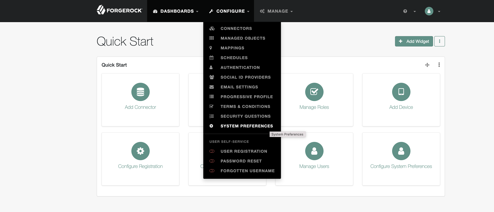
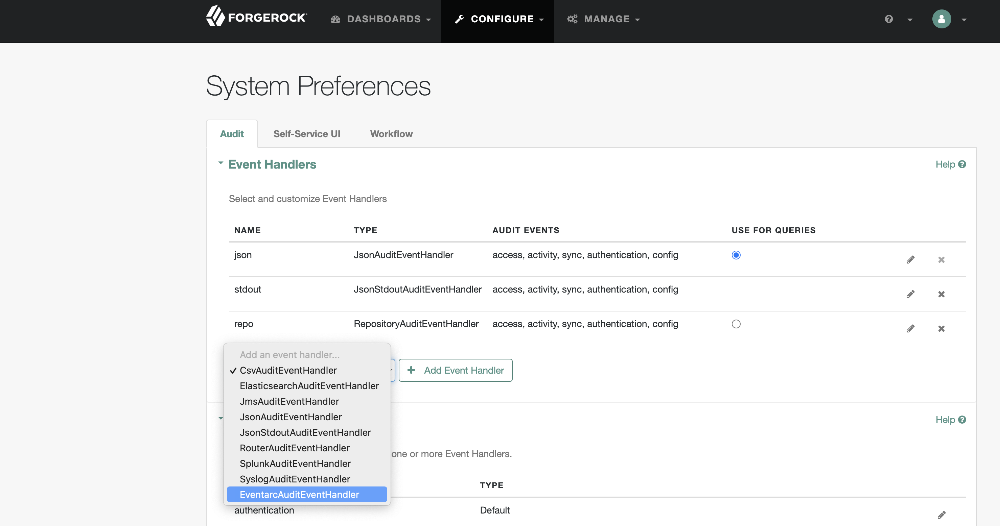
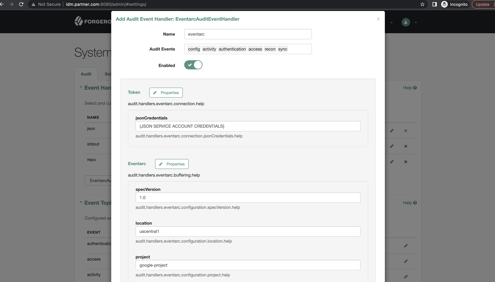
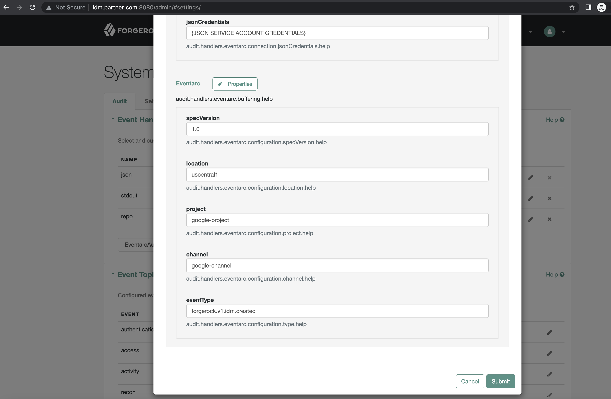
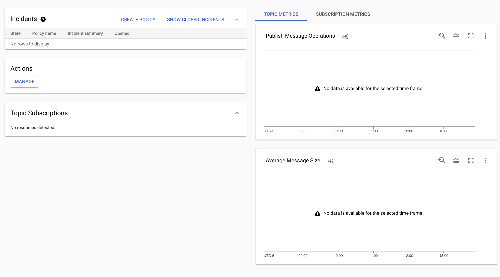

## Eventarc + ForgeRock Common Audit (CAUD)

This integration will send events from ForgeRock to Eventarc

(If you are not familiar with the [CAUD](https://www.forgerock.com/platform/common-services/common-audit) it is a framework for audit event handlers that are plugged in to our individual products. The handlers record events, logging them for example into files, relational databases, syslog, and now thanks to this repository  [Eventarc](https://cloud.google.com/eventarc/docs)).

The instructions for configuring the CAUD vary slightly from product to product; in the interest of simplicity the below is for openidm running on Ubuntu. 

Eventarc lets you asynchronously deliver events from Google services, SaaS, and your own apps using loosely coupled services that react to state changes. Eventarc requires no infrastructure management — you can optimize productivity and costs while building a modern, event-driven solution.

Information on creating channels and triggers in Eventarc can be found [here](https://cloud.google.com/eventarc/docs/third-parties/subscribe-to-forgerock ).

##### Steps to configure on openidm machine
- stop openidm if it is running
- download the forgerock-audit-eventarc-1.0.0.jar from the [releases](https://github.com/ForgeRock/Audit-Eventarc/releases) tab 
- copy the forgerock-audit-eventarc-1.0.0.jar file that you just used maven to build to your openidm/bundle directory
- add to your openidm/conf/audit.json the entry "org.forgerock.audit.eventarc.EventarcAuditEventHandler" to the existing "availableAuditEventHandlers" field
- restart openidm

##### Steps to configure in openidm UI
- navigate to http://yourhost:8080/admin/#settings/ in order to configure your System Preferences

- from the pull down next to 'add event handler' select the **EventArc** one

- click on the button 'add event handler'; in the ensuing dialog, give it a unique name and all the audit events you want sent to EventArc and toggle the 'enabled' radio button

- note the 'pending changes' banner, so scroll to the bottom and click 'Save'

#### Steps to verify the above is working
- to verify that your messages are being sent to EventArc, log in or log out of openidm, and then check the latest transaction in the EventArc dashboard

